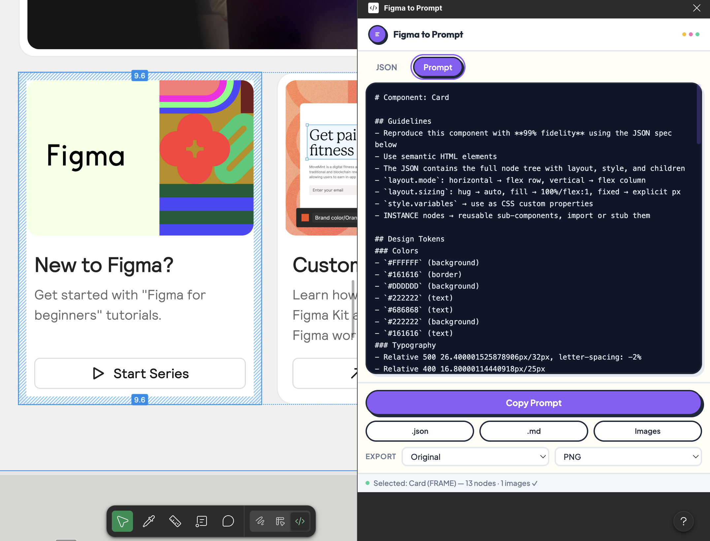
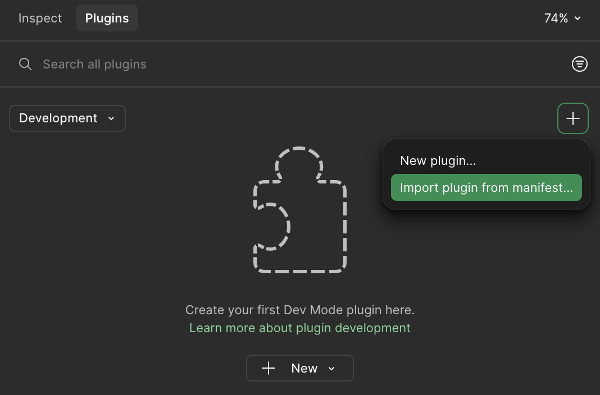

# Figma to Prompt

A Figma plugin that extracts design data into structured JSON and AI-ready markdown prompts — paste into ChatGPT, Claude, or any LLM to generate frontend components.



## Features

- **JSON Export** — Get a full hierarchical JSON of any frame (layout, styles, typography, colors)
- **AI Prompt** — Auto-generates a framework-agnostic markdown prompt with embedded JSON spec
- **Copy to Clipboard** — One-click copy of the current tab content (JSON or Prompt)
- **Download** — Save as `.json`, `.md`, or images
- **Image Export** — PNG / JPG / SVG with 1x–4x scale options
- **Real-time** — Updates instantly when you change your selection

## Install

### Option 1: Download from Releases (Recommended)

1. Go to [Releases](https://github.com/runkids/figma-to-prompt/releases) and download the latest `.zip`
2. Unzip — you'll get a folder with `manifest.json` and `dist/`

Then follow [Import into Figma](#import-into-figma).

### Option 2: Build from Source

```bash
git clone https://github.com/runkids/figma-to-prompt.git
cd figma-to-prompt
pnpm install
pnpm build
```

Then follow [Import into Figma](#import-into-figma).

### Import into Figma

> **Note:** Figma plugins can only be loaded in the [Figma Desktop app](https://www.figma.com/downloads/), not in the browser.

1. Open **Figma Desktop** and any design file
2. Click the **+** button in the top-right, then select **Import plugin from manifest...**

   

3. Select the `manifest.json` from the unzipped folder (or cloned repo root)
4. Done! **Figma to Prompt** appears under **Plugins** → **Development**

#### Launch

- **Menu:** Plugins → Development → Figma to Prompt
- **Quick search:** `⌘ /` (Mac) or `Ctrl /` (Windows), type `Figma to Prompt`

## Usage

1. Launch the plugin in Figma
2. Select a frame, component, or group on the canvas
3. Switch between tabs:
   - **JSON** — Structured design data
   - **Prompt** — AI-ready markdown prompt
4. **Copy** — Click the copy button to copy to clipboard
5. **Download** — Save as `.json`, `.md`, or export images (PNG/JPG/SVG, 1x–4x)
6. Paste the prompt into your AI tool and generate frontend code

## Output Example

The plugin generates a `UISerializedNode` tree:

```json
{
  "type": "FRAME",
  "name": "Card",
  "layout": {
    "mode": "vertical",
    "gap": 12,
    "padding": { "top": 16, "right": 16, "bottom": 16, "left": 16 },
    "mainAxisAlign": "min",
    "crossAxisAlign": "min",
    "primarySizing": "hug",
    "counterSizing": "fixed"
  },
  "style": {
    "fills": ["#FFFFFF"],
    "cornerRadius": 8,
    "opacity": 1
  },
  "width": 320,
  "height": 200,
  "children": [...]
}
```

The **Prompt** tab wraps this in a markdown template with conversion guidelines, ready to use.

## Development

### Prerequisites

- [Node.js](https://nodejs.org/) >= 18
- [pnpm](https://pnpm.io/)
- [Figma Desktop](https://www.figma.com/downloads/)

### Dev Mode

Run both watchers in separate terminals:

```bash
# Terminal 1 — sandbox (Figma API side)
pnpm dev:sandbox

# Terminal 2 — UI (plugin panel)
pnpm dev:ui
```

Save triggers a rebuild. Reopen the plugin in Figma to load the latest version.

### Test

```bash
pnpm test          # single run
pnpm test:watch    # watch mode
```

### Build

```bash
pnpm build
```

Outputs `dist/code.js` (sandbox) and `dist/ui.html` (UI panel).

### Release

```bash
pnpm release
```

Interactive version picker → updates `package.json` → commits → tags. Then push:

```bash
git push origin main --tags
```

GitHub Actions builds, packages the zip, and creates a Release with changelog.

## Architecture

```
src/
├── sandbox/          # Figma sandbox (no DOM access)
│   ├── main.ts       # Selection listener → extract → normalize → postMessage
│   ├── extractor.ts  # Walks SceneNode tree → UISerializedNode
│   └── normalizer.ts # Normalizes values (hex colors, line-height, etc.)
├── ui/               # iframe (no Figma API access)
│   ├── main.ts       # Tabs, copy, downloads, message handling
│   ├── prompt.ts     # Generates the AI markdown prompt
│   ├── ui.html       # Plugin panel HTML
│   └── style.css     # Tailwind CSS
└── shared/
    └── types.ts      # Shared type definitions
```

**Data flow:** Figma selection → `extractor` → `normalizer` → `postMessage` → UI render

## Tech Stack

- **TypeScript**
- **Vite** — Dual config bundler (sandbox + UI)
- **Vitest** — Unit testing
- **Tailwind CSS v4** — UI styling
- **vite-plugin-singlefile** — Inlines everything into a single `ui.html`

## License

[MIT](LICENSE)
